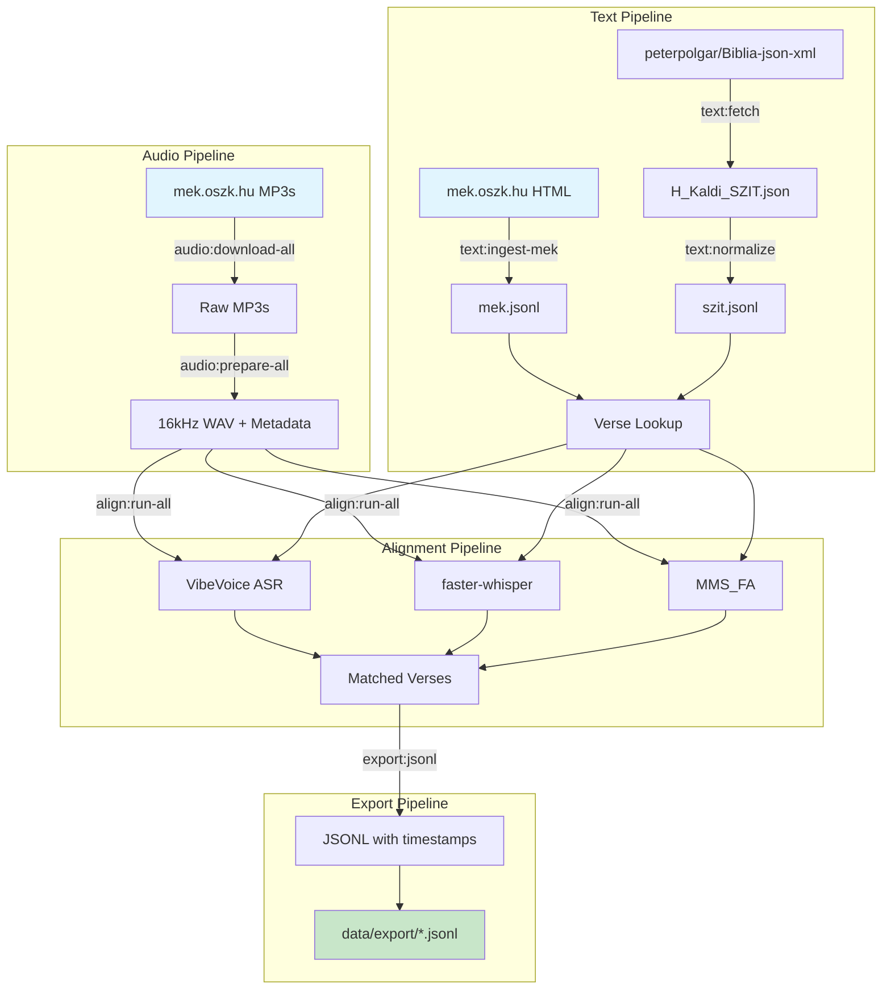

# BibliaVox

Hungarian Catholic Bible verse-to-audio alignment tool. Maps every verse of the Szent István Társulat Bible to precise timestamps in per-chapter audio recordings.

## Project Goals

BibliaVox solves a specific problem: locating any verse of the Hungarian Catholic Bible (Szent István Társulat translation) within audio recordings. The pipeline:

1. **Acquires text** from multiple sources (SZIT JSON, MEK HTML) covering all 73 Catholic Bible books
2. **Downloads and prepares audio** from mek.oszk.hu per-chapter MP3 recordings
3. **Aligns text to audio** using speech recognition models (VibeVoice, faster-whisper, MMS_FA)
4. **Exports JSONL** with precise timestamps, confidence scores, and text matching metrics

**Core value:** Every verse can be located in its audio recording — with timestamps and quality metadata.

## Architecture



## Quick Start

```bash
# Install dependencies
uv sync

# Run full pipeline on gold chapters (fast, for testing)
go-task export:run-gold MODEL=microsoft/VibeVoice-ASR-HF

# Run full pipeline on all 1175 chapters
go-task export:run MODEL=microsoft/VibeVoice-ASR-HF
```

## Taskfile Commands

### Development

| Command | Description | Input | Output |
|---------|-------------|-------|--------|
| `go-task lint` | Run ruff linter | `bibliavox/`, `tests/` | Terminal |
| `go-task format` | Auto-format code with ruff | `bibliavox/`, `tests/` | In-place |
| `go-task typecheck` | Run ty type checker | `bibliavox/` | Terminal |
| `go-task test` | Run test suite | `tests/` | Terminal |
| `go-task quality` | All checks (lint + format + typecheck + test) | `bibliavox/`, `tests/` | Terminal |

### Text Pipeline

| Command | Description | Input | Output |
|---------|-------------|-------|--------|
| `go-task text:ingest-mek` | Download and parse MEK HTML text corpus | mek.oszk.hu | `data/processed/text/mek.jsonl` |
| `go-task text:cross-validate` | Cross-validate SZIT vs MEK text coverage | `data/processed/text/*.jsonl` | Terminal |

### Audio Pipeline

| Command | Description | Input | Output |
|---------|-------------|-------|--------|
| `go-task audio:download-all` | Download all chapter MP3s from MEK | mek.oszk.hu playlist | `data/raw/audio/{BOOK}/{CHAPTER}.mp3` |
| `go-task audio:prepare-all` | Convert MP3s to 16kHz WAV with metadata | `data/raw/audio/` | `data/prepared/audio/{BOOK}/{CHAPTER}.wav` + `.meta.json` + `.index.json` |

### Alignment Pipeline

| Command | Description | Input | Output |
|---------|-------------|-------|--------|
| `go-task align:vibevoice BOOK=GEN CHAPTER=1` | Run VibeVoice on single chapter | `data/prepared/audio/{BOOK}/{CHAPTER}.wav` | `data/aligned/vibevoice/{BOOK}/{CHAPTER}.json` |
| `go-task align:evaluate-gold` | Evaluate models on 10 gold chapters | `data/prepared/audio/`, `data/processed/text/mek.jsonl` | `data/evaluation/{BOOK}_{CHAPTER}_{MODEL}_matched.json` |
| `go-task align:setup` | Pre-download model weights | HuggingFace Hub | `data/models/` |

### Export Pipeline

| Command | Description | Input | Output |
|---------|-------------|-------|--------|
| `go-task export:run` | Full pipeline on all chapters | `data/prepared/audio/`, `data/processed/text/mek.jsonl` | `data/export/*.jsonl` |
| `go-task export:run-gold` | Full pipeline on gold chapters only | Same as above (filtered) | `data/export/*_{MODEL}.jsonl` |
| `go-task export:jsonl` | Export alignment to JSONL | `data/evaluation/*_matched.json` | `data/export/{BOOK}_{CHAPTER}_{MODEL}.jsonl` |
| `go-task export:align` | Run alignment on all chapters | `data/prepared/audio/` | `data/aligned/{MODEL}/{BOOK}/{CHAPTER}.json` |

**Variables:**
- `MODEL=` — Model ID (default: `microsoft/VibeVoice-ASR-HF`)
- `GOLD=true` — Restrict to gold chapters (TIT 1-3, TOB 1-4, ZEP 1-3)
- `FORCE=true` — Force re-run, skip cache

## JSONL Output Format

Each line in the output JSONL contains:

```json
{
  "verse_ref": "GEN 1:1",
  "audio_file": "data/prepared/audio/GEN/001.wav",
  "start_sec": 6.195,
  "end_sec": 22.76,
  "source": "microsoft/VibeVoice-ASR-HF",
  "translation": "SZIT",
  "confidence": 0.951,
  "canonical_text": "Kezdetben teremtette Isten az eget és a földet.",
  "matched_text": "Kezdetben teremtette Isten az eget és a földet.",
  "wer": 0.0,
  "cer": 0.0
}
```

## Data Sources

| Source | Content | Coverage |
|--------|---------|----------|
| **mek.oszk.hu** | Audio MP3s + HTML text | 73 books, 1175 chapters |
| **peterpolgar/Biblia-json-xml** | SZIT JSON (H_Kaldi_SZIT.json) | 66 books |

> **Note:** The szentiras.eu API was considered as a text source but requires an API key. The peterpolgar/Biblia-json-xml GitHub repo provides the same SZIT translation in a more accessible format.

## Dependencies

### Python
- **typer** — CLI framework
- **rich** — Terminal UI (progress bars, tables)
- **pydantic-settings** — Configuration management
- **httpx** — Async HTTP client
- **beautifulsoup4** — HTML parsing (MEK text extraction)
- **rapidfuzz** — Fuzzy text matching
- **huggingface-hub** — Model downloads

### External Tools
- **uv** — Python package manager
- **go-task** — Task runner
- **ffmpeg/ffprobe** — Audio conversion (via Docker)
- **Docker + NVIDIA Container Toolkit** — GPU model inference

## GPU Models

| Model | Type | Use Case |
|-------|------|----------|
| `microsoft/VibeVoice-ASR-HF` | ASR + RapidFuzz | Best quality, Hungarian Bible |
| `systran/faster-whisper-large-v3` | Whisper | General purpose |
| `facebook/mms-1b-fl102` | Forced alignment | Phone-level timestamps |

## Project Structure

```
bibliavox/
├── cli/           # CLI subcommands (text, audio, align, export)
├── align/         # Alignment engines (transcribe, match, evaluate)
├── export/        # JSONL export writer
└── config.py      # Pydantic Settings configuration

data/
├── raw/           # Downloaded source files
├── processed/     # Normalized text, evaluation results
├── prepared/      # Audio WAVs with metadata
├── aligned/       # Cached alignment results
└── export/        # Final JSONL output
```

## License

MIT License. See [LICENSE](LICENSE) for details.
